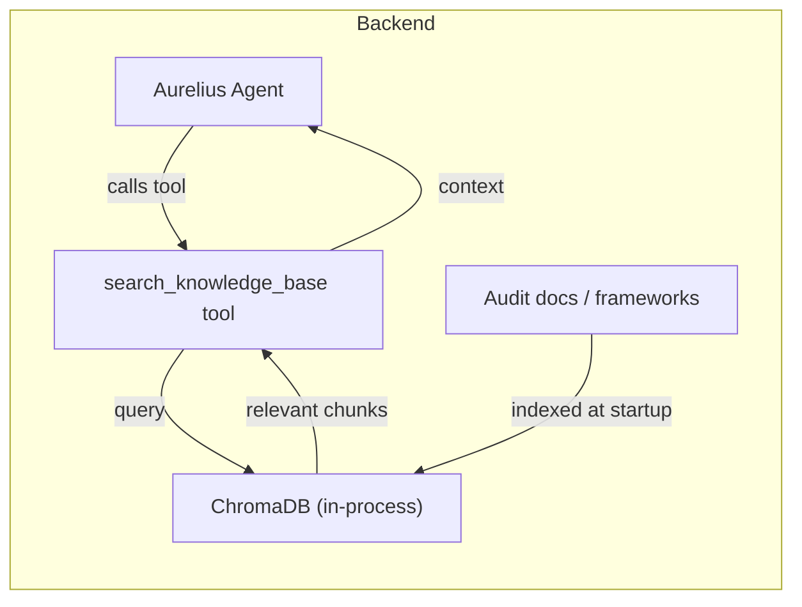
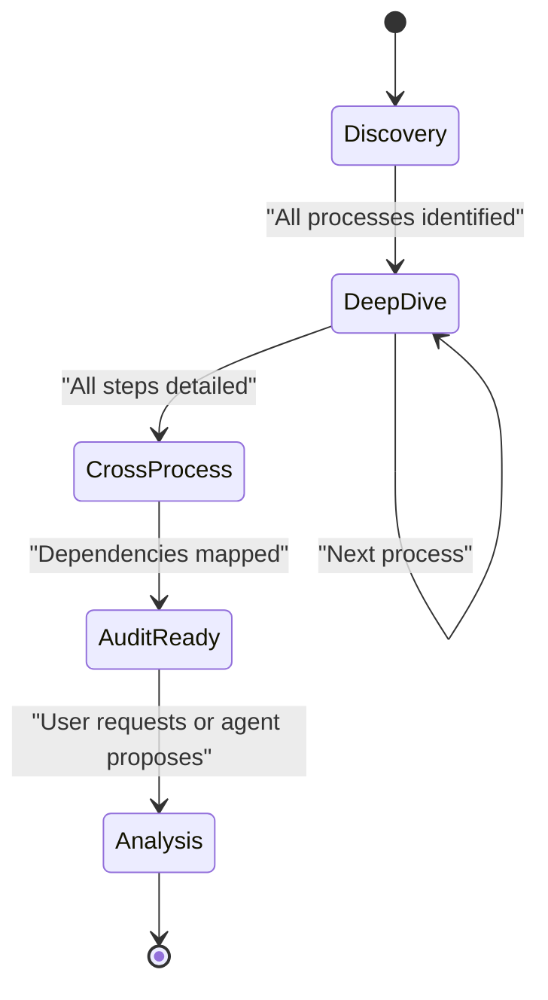

# RAG, Auditing Specialization, and Agent-Driven Interviews

## Current State

Aurelius is a **process-graph editing assistant** with a planner/executor architecture. It can propose and apply structural graph changes, and has a separate automation analyzer. Key gaps:

- **No domain knowledge**: The agent knows graph mechanics but nothing about process auditing, compliance frameworks, or industry best practices.
- **Purely reactive**: The agent only responds to user messages; it never proactively asks what information is missing.
- **Rich but empty metadata**: Nodes already support 18+ fields (`risks`, `pain_points`, `error_rate_percent`, `regulatory_constraints`, `sla_target`, etc.) in [backend/agent/tools.py](backend/agent/tools.py), but these are typically left blank because nobody prompts the user to fill them.

---

## Part 1: Auditing Specialization (RAG vs Prompt Engineering)

### Option A: Prompt-Based Specialization (Recommended for MVP / Hackathon)

Embed auditing domain knowledge directly into the system prompt. This is the fastest path and avoids new infrastructure.

**What to add to the prompt** in [backend/agent/prompt.py](backend/agent/prompt.py):

- An "Auditor" persona layer on top of the existing "Aurelius" role
- A structured **audit framework** the agent follows (inspired by ISO 19011 / process auditing methodology):
  - Process completeness: Are all steps documented? Are inputs/outputs defined?
  - Control points: Are there decision nodes for quality checks, approvals, error handling?
  - Risk assessment: Are risks identified per step? Are there mitigations?
  - Performance metrics: Are durations, volumes, error rates, SLAs captured?
  - Compliance: Are regulatory constraints documented?
  - Segregation of duties: Are actors defined and appropriately separated?
  - Automation readiness: Are automation potentials and notes filled in?
- **Industry-specific checklists** (e.g., for pharmacy: medication safety, cold chain, traceability)
- **Benchmarking heuristics** (e.g., "error rates above 2% in dispensing are a red flag")

**Pros**: Zero infrastructure, works immediately, stays within context window for Nova Pro (300K tokens).
**Cons**: Static knowledge, can not be updated without code changes, limited depth.

### Option B: Lightweight RAG with ChromaDB (Recommended for Post-Hackathon)

Add a vector-based knowledge retrieval system for deeper domain expertise.

**Architecture:**




**Implementation:**

- Add `chromadb` and `sentence-transformers` (or use Bedrock Titan Embeddings) to [backend/requirements.txt](backend/requirements.txt)
- Create `backend/knowledge/` directory with markdown/text documents:
  - Process auditing methodology (ISO 19011, COSO framework)
  - Industry-specific compliance requirements
  - Common process anti-patterns and red flags
  - Benchmarking data by industry/sector
- Create `backend/agent/knowledge.py`: ChromaDB initialization, document chunking, indexing at startup
- Add a new tool `search_knowledge_base(query: str) -> list[str]` to [backend/agent/tools.py](backend/agent/tools.py) available to the planner
- Agent automatically searches for relevant audit context when asking questions or proposing analysis

**Pros**: Extensible, can add new documents without code changes, deeper domain coverage.
**Cons**: Adds dependencies (~500MB for sentence-transformers), slightly more complex, embedding quality matters.

### Option C: Hybrid (Recommended Long-Term)

Combine a strong audit-aware prompt (Option A) with RAG (Option B) for deep-dive questions. The prompt provides the interview structure and general framework; RAG provides specific benchmarks, checklists, and regulations on demand.

---

## Part 2: Agent-Driven Interview Protocol

This is the more impactful change. The goal: the agent systematically interviews the user to collect all process information before proposing an audit analysis.

### Interview State Machine




**Phases:**

1. **Discovery**: Identify all processes, subprocesses, and high-level flow. Map organizational structure and actors.
2. **Deep-Dive**: For each process, systematically collect: step details, actors, durations, volumes, pain points, risks, current systems, inputs/outputs.
3. **Cross-Process**: Map handoffs, dependencies, data flows between processes. Identify bottlenecks.
4. **Audit-Ready**: Agent confirms it has sufficient information and proposes a comprehensive audit.
5. **Analysis**: Agent delivers structured audit findings with severity ratings.

### Backend Changes

**New tool: `check_completeness`** in [backend/agent/tools.py](backend/agent/tools.py)

The agent calls this to see what information is missing across the graph. Returns a structured completeness report:

```python
{
  "overall_score": 0.35,
  "by_process": {
    "S1 (Prescription)": {
      "score": 0.4,
      "missing_fields": {
        "P1.1": ["duration_min", "risks", "error_rate_percent"],
        "P1.2": ["actor", "inputs", "outputs", "pain_points"]
      }
    }
  },
  "critical_gaps": [
    "No risks documented for any step",
    "3 of 7 processes have no actor assignments",
    "SLA targets missing across all processes"
  ]
}
```

**New tool: `get_interview_state`** -- returns current phase + what topics have been covered.

**New tool: `set_interview_phase`** -- agent transitions between phases.

**New DB table**: `interview_state` (session_id, phase, covered_topics JSON, completeness_snapshot).

**Modified system prompt** in [backend/agent/prompt.py](backend/agent/prompt.py):

Add a new `INTERVIEW_PROTOCOL` section to the planner prompt that instructs the agent to:

- Check completeness at the start of each conversation
- Follow the phase-appropriate questioning strategy
- Ask focused questions (2-3 at a time, not overwhelming)
- Suggest which process to deep-dive into next based on what's least complete
- Proactively offer to update the graph with information the user provides
- Only suggest analysis when completeness is above a threshold (e.g., 70%)

**Modified chat flow** in [backend/agent/runtime_nova.py](backend/agent/runtime_nova.py):

- At the start of each chat turn, inject the completeness summary into the system prompt (alongside the full graph)
- Include the current interview phase in the system prompt
- The agent can call `check_completeness` at any time to reassess

### Frontend Changes

**Completeness indicator** in the Dashboard:

- A progress bar or score showing overall graph completeness
- Per-process completeness in the LandscapeView cards
- Visual cues on nodes with missing critical fields (e.g., subtle highlight)

**Interview phase indicator** in the chat panel:

- Show current phase (Discovery / Deep-Dive / Cross-Process / Audit-Ready)
- Clickable to see what's been covered

**Suggested questions** (optional):

- Below the chat, show 2-3 suggested next topics based on completeness gaps
- Clicking a suggestion sends it as a message

---

## Recommended Implementation Order

Start with the highest-impact, lowest-effort changes and layer on complexity:

1. **Prompt specialization** (Option A) -- immediate impact, no new dependencies
2. `**check_completeness` tool** -- gives the agent awareness of what's missing
3. **Interview protocol in prompt** -- makes the agent proactive
4. **Frontend completeness indicators** -- visual feedback loop
5. **RAG with ChromaDB** (Option B) -- deeper domain knowledge
6. **Full interview state machine** -- polished multi-phase experience

