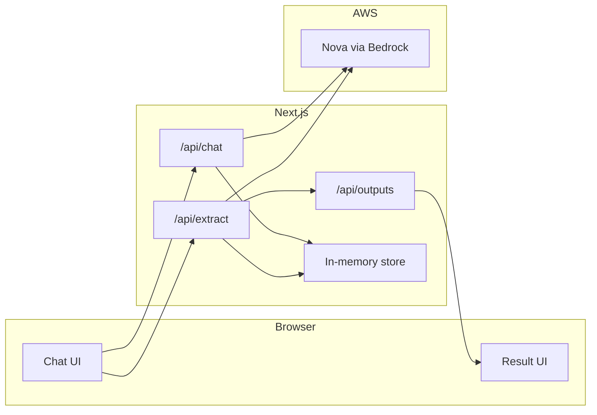

# Consularis hackathon MVP — build plan

## Scope

- **Goal:** One demo flow: structured pharmacy interview → extracted operational model → one executive output. Fits Amazon Nova AI Hackathon (Agentic AI category).
- **In scope:** Chat UI with phased interview, Nova for conversation and extraction, one output (process graph **or** bottlenecks + manual hours — pick one), in-memory session storage, deploy to Vercel.
- **Out of scope:** Auth, payments, DynamoDB, full role map, full tool graph, AI roadmap, multiple tenants.

---

## Tech stack


| Layer          | Choice                                                      |
| -------------- | ----------------------------------------------------------- |
| Frontend + API | Next.js 14+ (App Router)                                    |
| AI             | Amazon Nova via Bedrock (Nova 2 Lite for chat + extraction) |
| Storage        | In-memory (e.g. `Map<sessionId, session>`)                  |
| Hosting        | Vercel                                                      |
| Language       | TypeScript                                                  |


Single repo, three API routes, one AWS surface (Bedrock).

---

## Architecture




- `**/api/chat`:** Receives user message + sessionId; loads conversation from store; calls Nova with phase-aware system prompt; appends assistant reply; saves and returns.
- `**/api/extract`:** Receives sessionId; loads full conversation; calls Nova with extraction prompt (JSON: roles, tasks, tools, pain points); validates and returns structured model; optionally calls logic to build output.
- `**/api/outputs`:** Receives structured model (or sessionId); generates Mermaid graph **or** top 3 bottlenecks + manual hours; returns for UI.

---

## Implementation steps

### 1. Repo and Bedrock

- Create Next.js app (App Router, TypeScript) in the repo or a dedicated `app/` subtree. Install `@aws-sdk/client-bedrock-runtime`.
- Enable Amazon Nova in AWS Bedrock console; create IAM user with Bedrock access; add `AWS_REGION`, `AWS_ACCESS_KEY_ID`, `AWS_SECRET_ACCESS_KEY` to `.env.local` (and later Vercel).

### 2. Schema and storage

- Define TypeScript types for the operational model: `Role`, `Task`, `Tool`, `PainPoint`, `OperationalModel` (see [docs/CONSULARIS_VISION_AND_PLAN.md](docs/CONSULARIS_VISION_AND_PLAN.md) — roles, 5–10 tasks, tools, 2–3 pain points).
- Implement in-memory store: `getSession(sessionId)`, `setSession(sessionId, { messages, phase?, model? })`. Use a `Map` in a server-side module.

### 3. Bedrock + prompts

- Add `lib/bedrock.ts`: create Bedrock runtime client; expose `invokeNova(messages, systemPrompt?)` returning assistant text (and handle Nova 2 Lite request/response format).
- Add `lib/prompts.ts`: system prompt for the interview (pharmacy, 4–5 phases: overview, roles, processes, tools, pain points); extraction prompt that asks for a single JSON object matching `OperationalModel`.

### 4. Interview flow (chat)

- `**app/interview/page.tsx`:** Chat UI: list of messages, input, send button. On send: `POST /api/chat` with `{ sessionId, message }`. Display phase indicator (e.g. “Phase: Overview”).
- `**app/api/chat/route.ts`:** Load session; append user message; build messages array for Nova; call `invokeNova` with phase-aware system prompt from `lib/prompts.ts`; append assistant message; save session; return `{ message: assistantText }`.

### 5. Extraction

- `**app/api/extract/route.ts`:** Accept `POST { sessionId }`. Load session messages; call Nova with extraction prompt; parse JSON; validate against `OperationalModel` (or a relaxed shape); save `model` on session; return `{ model }`.

### 6. One killer output

- **Choose one:** (A) High-level process graph (Mermaid) **or** (B) Top 3 bottlenecks + estimated manual hours.
- **If graph:** In `lib/outputs.ts` (or inside a route), map `OperationalModel` to a Mermaid flowchart string (roles/processes as nodes, dependencies as edges). `app/api/outputs/route.ts` accepts `model` (or sessionId), returns `{ mermaid }`. `**app/twin/page.tsx`** (or `/interview/result`): fetch and render Mermaid (e.g. `mermaid` npm package or static code block for demo).
- **If bottlenecks:** Same route or a dedicated one: from `model` compute top 3 bottlenecks and manual hours (heuristic or Nova call); return `{ bottlenecks, manualHours }`. **Result page:** list bottlenecks + one number for hours.

### 7. Navigation and demo flow

- `**app/page.tsx`:** Landing with “Start interview” → links to `/interview`.
- From `/interview`, after enough messages, show “Generate twin” button → calls `/api/extract` then navigates to result page with sessionId (or model in state). Result page fetches `/api/outputs` and displays graph or bottlenecks.
- Optional: prefill or use a “demo” session with a realistic pharmacy conversation so judges can click through without typing.

### 8. Deploy and submission

- Connect repo to Vercel; add env vars; deploy. Ensure Bedrock is callable from Vercel (region/credentials).
- Record ~3 min demo video: start interview → a few Q&A → generate twin → show output. Add #AmazonNova. Submit to [Amazon Nova AI Hackathon](https://amazon-nova.devpost.com/rules) with category **Agentic AI**, link to live app, video, and repo (or private repo shared with [testing@devpost.com](mailto:testing@devpost.com) and [Amazon-Nova-hackathon@amazon.com](mailto:Amazon-Nova-hackathon@amazon.com)).

---

## File layout

```
app/
  page.tsx                    # Landing
  interview/page.tsx          # Chat UI
  twin/page.tsx               # Result (graph or bottlenecks)
  api/
    chat/route.ts
    extract/route.ts
    outputs/route.ts
lib/
  bedrock.ts                  # Bedrock client, invokeNova
  prompts.ts                  # Interview + extraction prompts
  schema.ts                   # OperationalModel types
  storage.ts                  # getSession, setSession (in-memory)
```

---

## Decisions to make before coding

1. **Killer output:** Process graph (Mermaid) **or** top 3 bottlenecks + manual hours. Pick one for the week.
2. **Result URL:** Single result page (e.g. `/twin?sessionId=...`) or pass model in state after extract (no sessionId in URL).

---

## Success criteria

- User can complete a short phased interview in the chat.
- “Generate twin” runs extraction and shows one output (graph or bottlenecks).
- Flow runs end-to-end on Vercel using Amazon Nova via Bedrock.
- Demo video and submission form filled for Agentic AI category.

