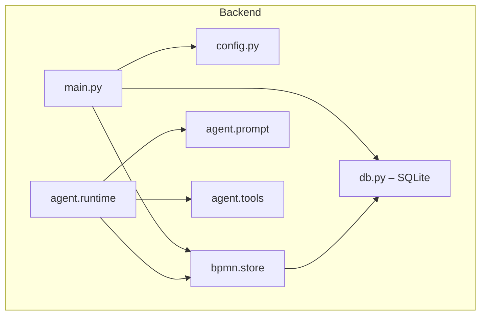

# Data flow and ownership

This document describes how requests flow through the Consularis backend and where graph and chat state live. It is the single reference for "who owns what."

## Backend module map



- **main.py**: FastAPI app, lifespan (init DB + seed baseline), CORS, router registration.
- **config.py**: Single place for env and constants (`GROQ_KEY`, `BASELINE_GRAPHS_DIR`, `DEFAULT_PROCESS_ID`, limits).
- **db.py**: In-memory SQLite singleton. Three tables: `baseline_processes`, `session_processes`, `chat_messages`. All persistence reads and writes go through this module.
- **bpmn.store**: Session-scoped BPMN graph CRUD. Keeps a parsed `BpmnModel` cache keyed by `(session_id, process_id)`. Every mutation triggers a `_persist` call that serializes the model back to SQLite. Multi-process: each session can have many processes (global + subprocesses).
- **agent**: Prompt, tools, runtime. Tools call `bpmn.store` by `session_id` and `process_id`.

## Where state lives

| State | Location | Key |
|-------|----------|-----|
| **Baseline processes** | `db.baseline_processes` table | `process_id` |
| **Session graphs** | `db.session_processes` table | `(session_id, process_id)` |
| **Chat history** | `db.chat_messages` table | `session_id` |
| **Parsed models (cache)** | `bpmn.store._cache` dict | `(session_id, process_id)` |

All state lives in a single in-memory SQLite connection (`:memory:`). Data is structured via SQL but ephemeral — it is lost on process restart. The cache layer avoids re-parsing BPMN XML on every request within a session.

## Request path

- **GET /health**: Health check; no DB or session.
- **GET /api/graph/baseline?process_id=…**: Serves baseline BPMN XML from SQLite. No session required. Defaults to `Process_Global`.
- **GET /api/graph/export?session_id=…&process_id=…**: Returns session BPMN XML. If the session doesn't exist yet, clones baseline into a new session automatically.
- **GET /api/graph/resolve?session_id=…&name=…&process_id=…**: Fuzzy-matches a step/lane/process name fragment to technical IDs. Used by the agent for name-based resolution.
- **POST /api/chat**: Validates body → `db.append_chat_message(user)` → `run_chat(history)` → `db.append_chat_message(assistant)` → returns `{ message, bpmn_xml, meta }`. Chat runs under a per-session lock so concurrent requests for the same session do not interleave.

## State ownership: backend only, frontend is view

- **Single source of truth**: The graph and chat live only in the backend (SQLite). The backend is the only place that mutates or persists state.
- **Frontend**: Holds a view of BPMN XML for rendering only. It is not authoritative. The frontend refreshes from backend BPMN XML after chat updates and on explicit export fetches.

## Where the baseline comes from

The baseline is defined by a **process registry** and a set of **BPMN files**:

```
backend/data/graphs/
├── registry.json       # Process tree: ids, names, parent-child, file paths
├── global.bpmn         # Root process with call activities to P1-P7
├── P1.bpmn             # Prescription subprocess
├── P2.bpmn             # Selection, Acquisition, and Reception
├── P3.bpmn             # Storage and Storage Management
├── P4.bpmn             # Distribution
├── P5.bpmn             # Dispensing and Preparation
├── P6.bpmn             # Administration
└── P7.bpmn             # Monitoring and Waste Management
```

At startup, `db.seed_baseline()` reads `registry.json`, loads each BPMN file, and inserts rows into the `baseline_processes` table. The baseline is read-only after startup.

**New sessions**: When a session first accesses a process, `db.clone_baseline_to_session()` copies all baseline rows into `session_processes`. Each session starts from the same initial graph; each session then has its own copy that can be personalized by chat. The baseline stays unchanged.

## Graph format contract

- Canonical graph format is **BPMN 2.0 XML**.
- API and frontend graph exchange uses BPMN XML only.
- Custom metadata is stored in BPMN extension elements under the `http://consularis.example/bpmn` namespace.
