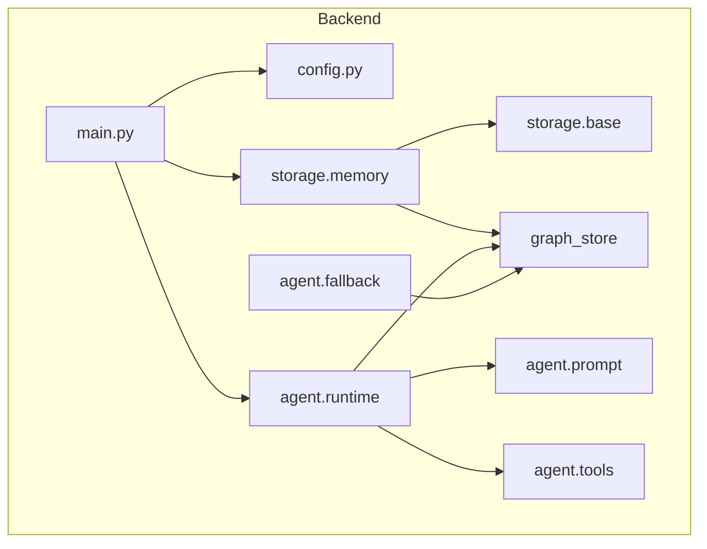

# Data flow and ownership

This document describes how requests flow through the Consularis backend and where graph and chat state live. It is the single reference for "who owns what."

## Backend structure

- **main.py**: Routes only; one global `store`; validates `session_id`; single fallback path when no tools.
- **config.py**: Single place for env and constants.
- **storage**: Protocol in base, in-memory implementation; chat in `_chat`, graph delegated to graph_store.
- **graph_store**: Session-scoped graph (one dict per `session_id`); baseline from config; all graph CRUD and validation (risk dedupe, no duplicate edges).
- **agent**: Split into prompt, tools, fallback, runtime; tools and fallback call graph_store by `session_id`.

## Where state lives

- **Graph**: Lives in `graph_store._sessions` (keyed by `session_id`). All writes go through graph_store (tools and fallback).
- **Chat**: Lives in the store’s `_chat` dict (e.g. `storage/memory.py`), keyed by `session_id`.
- **Conceptually**: One session = one graph (in graph_store) + one chat history (in store). Implemented in two modules for separation of concerns; the store interface (`get_graph`, `get_chat_history`, `append_chat_message`) is the single abstraction used by main and agent.

## Request path

- **GET /api/graph**: main validates `session_id` → store.get_graph(session_id) → returns graph (deep copy). No chat involved.
- **POST /api/chat**: main validates body → append user message → run_chat(history) → if no tools used, try_apply_message_update (fallback) → append assistant message → return message + deep copy of graph. The chat handler runs under a per-session lock so concurrent requests for the same session do not interleave.

## State location: backend only, frontend is view

- **Single source of truth**: The graph and chat live only in the backend. The backend is the only place that mutates or persists state.
- **Frontend**: Holds a **view copy** for rendering only. It is **not** authoritative. The frontend replaces this copy whenever the backend sends a new graph (e.g. after each chat response or after GET /api/graph). The frontend never saves the graph; it only triggers backend updates (POST /api/chat) and displays what the backend returns.

## Where the original graph is kept

- The **baseline** graph is the file at `BASELINE_GRAPH_PATH` (default: `backend/data/pharmacy_circuit.json`). It is loaded once at startup and cached; the file is read-only and never modified by the app.
- **New sessions**: When a new session is created, the backend uses `copy.deepcopy(cached_baseline)` and stores that copy in the session. Every user/session starts from the same initial graph; each session then has its own copy that can be personalized by chat. The baseline itself stays unchanged.
- **With persistence**: The baseline (or its cached copy) remains the template. New sessions are still created by cloning that baseline; only the **session** data (personalized graph + chat) is persisted.

## Graph shape (implicit contract)

Graph is a `dict` with:

- `phases`: list of `{ id, name, steps: [ { id, name, actor, duration_min, description, inputs, outputs, risks } ] }`
- `flow_connections`: list of `{ from, to, label?, condition? }`

The frontend and backend both use this shape; no separate schema file is required for basic operation.
