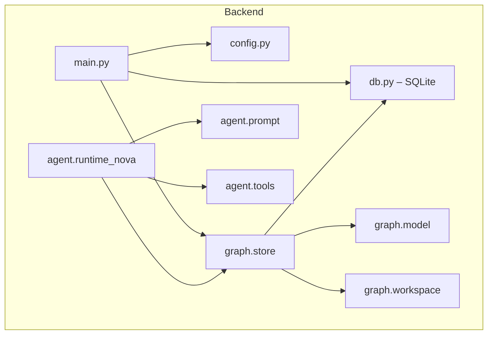

# Data flow and ownership

This document describes how requests flow through the Consularis backend and where graph and chat state live. It is the single reference for "who owns what."

## Backend module map



- **main.py**: FastAPI app, lifespan (init DB + seed baseline), CORS, router registration.
- **config.py**: Single place for env and constants (AWS/Bedrock, `BASELINE_GRAPHS_DIR`, `BASELINE_WORKSPACE_PATH`, `DEFAULT_PROCESS_ID`, limits).
- **db.py**: In-memory SQLite singleton. Tables: `baseline_processes`, `baseline_workspace`, `session_processes`, `session_workspace`, `session_process_history`, `chat_messages`. All persistence reads and writes go through this module. Graph data is stored as **graph_json** (JSON strings).
- **graph.store**: Session-scoped JSON graph CRUD. Keeps a parsed `ProcessGraph` cache keyed by `(session_id, process_id)` and a workspace cache per session. Every mutation (except position-only updates) triggers `_persist`, which can push to history then write JSON to SQLite.
- **graph.model**: `ProcessGraph` wrapper around the raw JSON dict; no separate parsing layer.
- **graph.workspace**: `WorkspaceManifest` wrapper for the process tree index.
- **agent**: Prompt, tools, runtime. Tools call `graph.store` by `session_id` and `process_id`.

## Where state lives

| State | Location | Key |
|-------|----------|-----|
| **Baseline processes** | `db.baseline_processes` table | `process_id` (graph_json) |
| **Baseline workspace** | `db.baseline_workspace` table | single row (workspace_json) |
| **Session graphs** | `db.session_processes` table | `(session_id, process_id)` (graph_json) |
| **Session workspace** | `db.session_workspace` table | `session_id` (workspace_json) |
| **Undo history** | `db.session_process_history` table | `(session_id, process_id)` |
| **Chat history** | `db.chat_messages` table | `session_id` |
| **Parsed graph cache** | `graph.store._cache` dict | `(session_id, process_id)` |
| **Workspace cache** | `graph.store._ws_cache` dict | `session_id` |

All state lives in a single in-memory SQLite connection (`:memory:`). The cache layer avoids re-parsing JSON on every request within a session.

## Request path

- **GET /health**: Health check; no DB or session.
- **GET /api/graph/json?session_id=…&process_id=…**: Session graph as JSON. Clones baseline into session on first access.
- **GET /api/graph/baseline/json?process_id=…**: Baseline graph as JSON. No session required.
- **GET /api/graph/workspace?session_id=…**: Workspace manifest (process tree) as JSON.
- **GET /api/graph/export?session_id=…&process_id=…**: Session graph as BPMN 2.0 XML for download.
- **GET /api/graph/resolve?session_id=…&name=…&process_id=…**: Fuzzy-matches a step/lane name fragment to IDs. Used by the agent.
- **POST /api/chat**: Validates body → `db.append_chat_message(user)` → `run_chat(history)` → `db.append_chat_message(assistant)` → returns `{ message, graph_json, meta }`. Chat runs under a per-session lock.

## State ownership: backend only, frontend is view

- **Single source of truth**: The graph and chat live only in the backend (SQLite). The backend is the only place that mutates or persists state.
- **Frontend**: Holds a view of the graph (as React Flow nodes/edges transformed from JSON) for rendering only. It refreshes from the backend after chat updates and on load.

## Where the baseline comes from

The baseline is defined by a **workspace manifest** and **JSON graph files**:

```
backend/data/
├── workspace.json      # Process tree: root, processes (ids, names, children, graph_file paths)
├── graphs/
│   ├── global.json     # Root process with subprocess steps (P1–P7)
│   ├── P1.json         # Prescription subprocess
│   ├── P2.json … P7.json
```

At startup, `graph.store.init_baseline()` (which calls `db.seed_baseline`) reads `workspace.json`, loads each graph JSON file, and inserts rows into `baseline_processes` and `baseline_workspace`. The baseline is read-only after startup.

**New sessions**: When a session first accesses a process or workspace, `db.clone_baseline_to_session()` copies all baseline rows into the session tables. Each session starts from the same initial graph; each session then has its own copy that can be personalized by chat or GUI edits.

## Graph format contract

- Canonical graph format is **JSON** (process_id, name, lanes, steps, flows, position, metadata).
- API and frontend graph exchange use JSON. The frontend transforms JSON to React Flow nodes/edges via `graphTransform.js`.
- **BPMN 2.0 XML** is produced on demand by `graph.bpmn_export` for download only (model elements; no diagram interchange).
