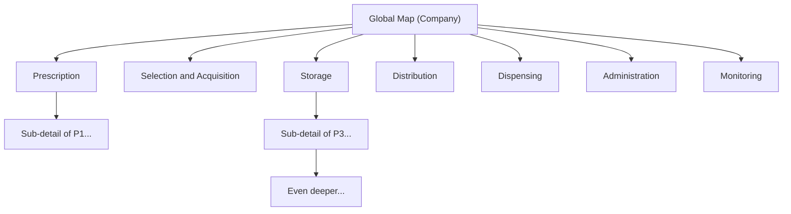

# Enterprise Hierarchical Digital Twin

## Problem

Current system = one flat BPMN process per session. Cannot scale to map an entire company with dozens of departments, hundreds of processes, and multiple levels of detail. Need a **process tree** where each node is a readable BPMN diagram, and the full tree is the digital twin.

---

## Architecture: Process Tree




- Each box = one `BpmnModel` = one readable BPMN diagram.
- Parent links to child via **call activity** (`calledElement = child process_id`).
- Depth is **unlimited** -- any call activity can reference another process that itself contains call activities.
- The tree is described by a **process registry** (manifest), not hardcoded.

---

## 1. Naming strategy

**Principle**: IDs are for machines; names are for humans. Keep both, expose names everywhere the client sees.

### IDs (stable, internal)

- Process IDs: `Process_Global`, `Process_P1`, `Process_P1_Detail`, `Process_P3_2_Sub` -- any slug, unique per session.
- Node/task IDs: `P1.1`, `P1.2`, `Call_P1`, etc. -- generated, never shown raw to the user.
- Phase/lane IDs: `P1`, `P2`, etc.

### Names (human-readable, shown everywhere)

- Process names: "Pharmacy Medication Circuit", "Prescription", "Storage Management", etc. Stored as `process_name` in `BpmnModel` and in the registry.
- Task names: "Verify Prescription", "Approve Prescription", etc. Stored as `task.name`.
- Lane names: "Prescription", "Distribution", etc. Stored as `lane.name`.

### Where names appear


| Surface                                | What is shown                                                              |
| -------------------------------------- | -------------------------------------------------------------------------- |
| Frontend process selector / breadcrumb | Process **name** (from registry)                                           |
| BPMN diagram labels                    | Task/lane **name** (from model)                                            |
| Agent graph summary (LLM context)      | `P1 Prescription: P1.1 (Prescribe Medication), P1.2 (Verify Prescription)` |
| Agent tool calls                       | Use **node_id** / **process_id** (resolved from name)                      |
| API query params                       | `process_id=Process_P1` (stable slug)                                      |
| Chat with client                       | Client says "Verify Prescription"; agent resolves to `P1.2`                |


### Implementation

- **Graph summary** ([backend/bpmn/store.py](backend/bpmn/store.py) `get_graph_summary`): Change from `P1 Prescription: P1.1, P1.2` to `P1 Prescription: P1.1 (Prescribe Medication), P1.2 (Verify Prescription), P1.3 (Approve Prescription)`.
- **Process list API**: Return `[{ "process_id": "Process_P1", "name": "Prescription", "parent_id": "Process_Global" }, ...]`.
- **Agent prompt** ([backend/agent/prompt.py](backend/agent/prompt.py)): Add instruction: "Users refer to steps by name. Use the graph summary or resolve_step tool to find the correct step ID before calling tools."
- **New agent tool** `resolve_step`: `resolve_step(name_or_fragment) -> { "node_id": "P1.2", "name": "Verify Prescription", "process_id": "Process_P1" }`. Fuzzy match against all tasks in the current process (or across processes). Lets the LLM handle "change the duration of verify prescription" without the user knowing IDs.

---

## 2. Process registry (manifest)

Central source of truth for "which processes exist" and their parent-child relationships.

**File**: `backend/data/graphs/registry.json`

```json
{
  "processes": [
    {
      "process_id": "Process_Global",
      "name": "Pharmacy Medication Circuit",
      "parent_id": null,
      "bpmn_file": "global.bpmn"
    },
    {
      "process_id": "Process_P1",
      "name": "Prescription",
      "parent_id": "Process_Global",
      "bpmn_file": "P1.bpmn"
    },
    {
      "process_id": "Process_P2",
      "name": "Selection, Acquisition, and Reception",
      "parent_id": "Process_Global",
      "bpmn_file": "P2.bpmn"
    }
  ]
}
```

- **parent_id** forms the tree. `null` = root.
- **Adding more depth**: Add a new entry with `parent_id` pointing to any existing process. Add a call activity in the parent's BPMN. No code changes needed -- the system discovers processes from the registry.
- **Future**: Registry could move to a DB table. For now, JSON file + in-memory dict is sufficient.
- **Session-level override**: Each session gets a deep copy of the baseline registry. The agent (or user) can add new subprocesses at runtime via an `add_process` tool, which creates a new BpmnModel, adds it to the session's process dict, and inserts a call activity in the parent.

---

## 3. Backend model changes

### 3.1 Call activities in BpmnModel ([backend/bpmn/model.py](backend/bpmn/model.py))

Add `call_activities: list[dict]` alongside `tasks`. Each:

```python
{"id": "Call_P1", "name": "Prescription", "called_element": "Process_P1", "lane_id": ""}
```

- Include in `all_flow_node_ids()` so layout and validation work.
- Add `flow_node_type` case: `"callActivity"` -> reuse task size (or slightly larger with a "+" icon).
- `calledElement` is the link to the child process; the registry maps it to a BPMN file/model.

### 3.2 Parser ([backend/bpmn/parser.py](backend/bpmn/parser.py))

When iterating process children, handle `bpmn:callActivity`:

- Read `calledElement` attribute.
- Parse extension elements (same as tasks).
- Append to `model.call_activities`.

### 3.3 Serializer ([backend/bpmn/serializer.py](backend/bpmn/serializer.py))

- Emit `callActivity` elements with `calledElement` attribute.
- Layout: add them to `layout_bounds` via `flow_node_type`.

---

## 4. Backend store refactor ([backend/bpmn/store.py](backend/bpmn/store.py))

### Current

```python
_sessions: dict[str, BpmnModel] = {}
_cached_baseline: BpmnModel | None = None
```

### New

```python
_baseline_models: dict[str, BpmnModel] = {}        # process_id -> BpmnModel
_baseline_registry: list[dict] = []                  # from registry.json
_sessions: dict[str, dict[str, BpmnModel]] = {}     # session_id -> {process_id -> BpmnModel}
_session_registries: dict[str, list[dict]] = {}      # session_id -> registry (copy)
```

### Key changes

- `init_baseline()`: Read `registry.json`, parse each `bpmn_file` into `_baseline_models[process_id]`.
- `get_or_create_session(session_id)`: Deep-copy all baseline models and registry into the session.
- All accessors gain `process_id` param (default `"Process_Global"`):
  - `get_bpmn_xml(session_id, process_id="Process_Global")`
  - `get_graph_json(session_id, process_id="Process_Global")`
  - `get_graph_summary(session_id, process_id="Process_Global")`
  - `get_node(session_id, node_id, process_id="Process_Global")`
  - `update_node(session_id, node_id, updates, process_id=...)`
  - `add_node(session_id, phase_id, step_data, process_id=...)`
  - etc.
- New: `get_process_tree(session_id)` -> returns the registry as a tree for the frontend.
- New: `resolve_step(session_id, name_fragment, process_id=None)` -> fuzzy-match task name across one or all processes, return `{ node_id, name, process_id }`.
- **Backward compat**: If `BASELINE_GRAPHS_DIR` is not set, fall back to single-file mode (load `BASELINE_GRAPH_PATH` as `Process_Global`, no registry).

---

## 5. API changes ([backend/routers/graph.py](backend/routers/graph.py))


| Endpoint                           | Change                                                                         |
| ---------------------------------- | ------------------------------------------------------------------------------ |
| `GET /api/graph/baseline`          | Add optional `?process_id=` (default `Process_Global`)                         |
| `GET /api/graph/export`            | Add optional `?process_id=`                                                    |
| `GET /api/graph/json`              | Add optional `?process_id=`                                                    |
| **New** `GET /api/graph/processes` | Returns process tree: `[{ process_id, name, parent_id, children: [...] }]`     |
| **New** `GET /api/graph/resolve`   | `?session_id=&name=Verify` -> returns matching node(s) with process_id         |
| `POST /api/chat`                   | Request body gains optional `process_id` field; agent operates on that process |


---

## 6. Agent changes

### 6.1 Runtime ([backend/agent/runtime.py](backend/agent/runtime.py))

- Accept `process_id` from chat request; pass to all tool handlers.
- Graph context line becomes: `"Current process: Prescription (Process_P1). Steps: P1.1 (Prescribe Medication), P1.2 (Verify Prescription), ..."`.

### 6.2 Tools ([backend/agent/tools.py](backend/agent/tools.py))

- All existing tools (`get_graph`, `get_node`, `update_node`, etc.) operate on the current `process_id` (passed via runtime, not as a tool argument -- keeps it simple).
- New tool: `resolve_step(name)` -- returns `{ node_id, name, process_id }` so the agent can map "Verify Prescription" to `P1.2`.
- New tool: `list_processes()` -- returns the process tree so the agent knows what subgraphs exist.
- New tool: `navigate_process(process_id)` -- switches the "current process" context mid-conversation (for when a user says "go into the Distribution subprocess").
- Future: `add_process(parent_id, name)` -- creates a new empty subprocess and a call activity in the parent.

### 6.3 Prompt ([backend/agent/prompt.py](backend/agent/prompt.py))

Add to system prompt:

- "The process graph is hierarchical. You are currently viewing one process at a time. Use `list_processes` to see all available subprocesses. Use `resolve_step(name)` to find a step by name when the user refers to it by name rather than ID."
- "Users refer to steps and processes by their real names. Always resolve to the correct ID before calling tools."

---

## 7. Persistence ([backend/storage/file.py](backend/storage/file.py))

Session JSON changes from:

```json
{ "graph": "<xml>", "chat": [...] }
```

to:

```json
{
  "registry": [...],
  "graphs": {
    "Process_Global": "<xml>",
    "Process_P1": "<xml>",
    ...
  },
  "chat": [...]
}
```

- On load: restore registry and all models.
- Backward compat: if file has `"graph"` key (old format), treat as single-process `Process_Global` and create default registry.

---

## 8. Frontend changes

### 8.1 State ([frontend/src/pages/Dashboard.jsx](frontend/src/pages/Dashboard.jsx))

Add:

- `processId` state (default `"Process_Global"`).
- `processTree` state (fetched from `GET /api/graph/processes`).
- `breadcrumb` derived from `processTree` + current `processId` (e.g. `Global > Prescription`).

### 8.2 Process navigation

- **Breadcrumb bar** above the canvas: `Global > Prescription > Sub-detail`. Each segment is clickable (navigates up).
- **Drill-down**: In BPMN view, double-click a call activity -> set `processId` to its `calledElement`. In Process view, click a phase card -> drill into that subprocess.
- **Process sidebar/dropdown** (optional): Tree view of all processes; click to jump.

### 8.3 API client ([frontend/src/services/api.js](frontend/src/services/api.js))

- `getBpmnXml(sessionId, { processId, ...options })` -> `GET /api/graph/export?session_id=...&process_id=...`
- `getProcessTree(sessionId)` -> `GET /api/graph/processes?session_id=...`
- `sendChat(sessionId, message, { processId })` -> includes `process_id` in body.

### 8.4 Hooks ([frontend/src/hooks/useBpmnXml.js](frontend/src/hooks/useBpmnXml.js))

- Add `processId` dependency. When it changes, refetch XML for the new process.

### 8.5 Viewer ([frontend/src/components/BpmnViewer.jsx](frontend/src/components/BpmnViewer.jsx))

- Receive `processId` prop.
- On call activity double-click: emit an `onDrillDown(calledElement)` callback -> parent sets `processId`.
- Register a bpmn-js event listener for `element.dblclick` on call activities.

---

## 9. Generate initial hierarchy files

One-time script or manual process to split [backend/data/pharmacy_circuit.bpmn](backend/data/pharmacy_circuit.bpmn) into `backend/data/graphs/`:

1. `**global.bpmn`**: Process `Process_Global`, name "Pharmacy Medication Circuit". One call activity per phase (Call_P1..Call_P7), connected linearly: Start -> Call_P1 -> Call_P2 -> ... -> Call_P7 -> End.
2. `**P1.bpmn` through `P7.bpmn`**: Each contains the tasks, gateways, and **intra-phase** sequence flows from the original. Start event, phase tasks, end event.
3. `**registry.json`**: 8 entries (global + P1..P7), all children of global.
4. **Cross-phase flows** (e.g. G2 -> P5.1): For v1, represent as edges in the global map between call activities (e.g. Call_P2 -> Call_P5 with condition "In stock"). Internal phase subgraphs only have intra-phase flows.

Script: `backend/scripts/split_baseline.py` -- reads pharmacy_circuit.bpmn, writes `backend/data/graphs/*.bpmn` + `registry.json`.

---

## 10. Scaling to full enterprise digital twin

This architecture handles growth:

- **More processes**: Add BPMN files + registry entries. No code changes.
- **More depth**: Any call activity can point to a sub-sub-process. The tree grows arbitrarily.
- **Multiple departments**: Global map has call activities for each department; each department has its own subprocess tree.
- **Dynamic creation**: Agent's `add_process` tool creates new subprocess at runtime, adds call activity in parent, adds registry entry. Session-level only (baseline unchanged).
- **KPI/metrics layer** (future): Extend `extension_elements` on call activities with KPIs, SLAs, ownership, cost. The digital twin becomes not just a process map but an operational dashboard per subprocess.

---

## 11. Implementation order


---

## 12. Files touched (summary)

**Backend (modify)**:

- [backend/bpmn/model.py](backend/bpmn/model.py) -- call_activities list, flow_node_type, all_flow_node_ids
- [backend/bpmn/parser.py](backend/bpmn/parser.py) -- parse callActivity elements
- [backend/bpmn/serializer.py](backend/bpmn/serializer.py) -- serialize callActivity, layout
- [backend/bpmn/layout.py](backend/bpmn/layout.py) -- size for callActivity nodes
- [backend/bpmn/store.py](backend/bpmn/store.py) -- multi-process session store, resolve_step, get_graph_summary with names
- [backend/config.py](backend/config.py) -- BASELINE_GRAPHS_DIR
- [backend/routers/graph.py](backend/routers/graph.py) -- process_id param, /processes endpoint
- [backend/routers/chat.py](backend/routers/chat.py) -- process_id in request body
- [backend/agent/prompt.py](backend/agent/prompt.py) -- hierarchical instructions, name resolution
- [backend/agent/tools.py](backend/agent/tools.py) -- resolve_step, list_processes, navigate_process tools
- [backend/agent/runtime.py](backend/agent/runtime.py) -- process_id threading
- [backend/storage/file.py](backend/storage/file.py) -- multi-graph persistence
- [backend/storage/memory.py](backend/storage/memory.py) -- adapt to multi-process
- [backend/graph_store.py](backend/graph_store.py) -- re-export new signatures

**Backend (create)**:

- `backend/data/graphs/registry.json`
- `backend/data/graphs/global.bpmn`
- `backend/data/graphs/P1.bpmn` through `P7.bpmn`
- `backend/scripts/split_baseline.py` (optional, one-time)

**Frontend (modify)**:

- [frontend/src/services/api.js](frontend/src/services/api.js) -- processId params, getProcessTree
- [frontend/src/hooks/useBpmnXml.js](frontend/src/hooks/useBpmnXml.js) -- processId dependency
- [frontend/src/pages/Dashboard.jsx](frontend/src/pages/Dashboard.jsx) -- processId state, breadcrumb, drill-down
- [frontend/src/components/GraphCanvas.jsx](frontend/src/components/GraphCanvas.jsx) -- pass processId
- [frontend/src/components/BpmnViewer.jsx](frontend/src/components/BpmnViewer.jsx) -- processId prop, call activity click handler

**Docs**:

- [docs/GRAPH_STRUCTURE.md](docs/GRAPH_STRUCTURE.md) -- rewrite for hierarchical model

