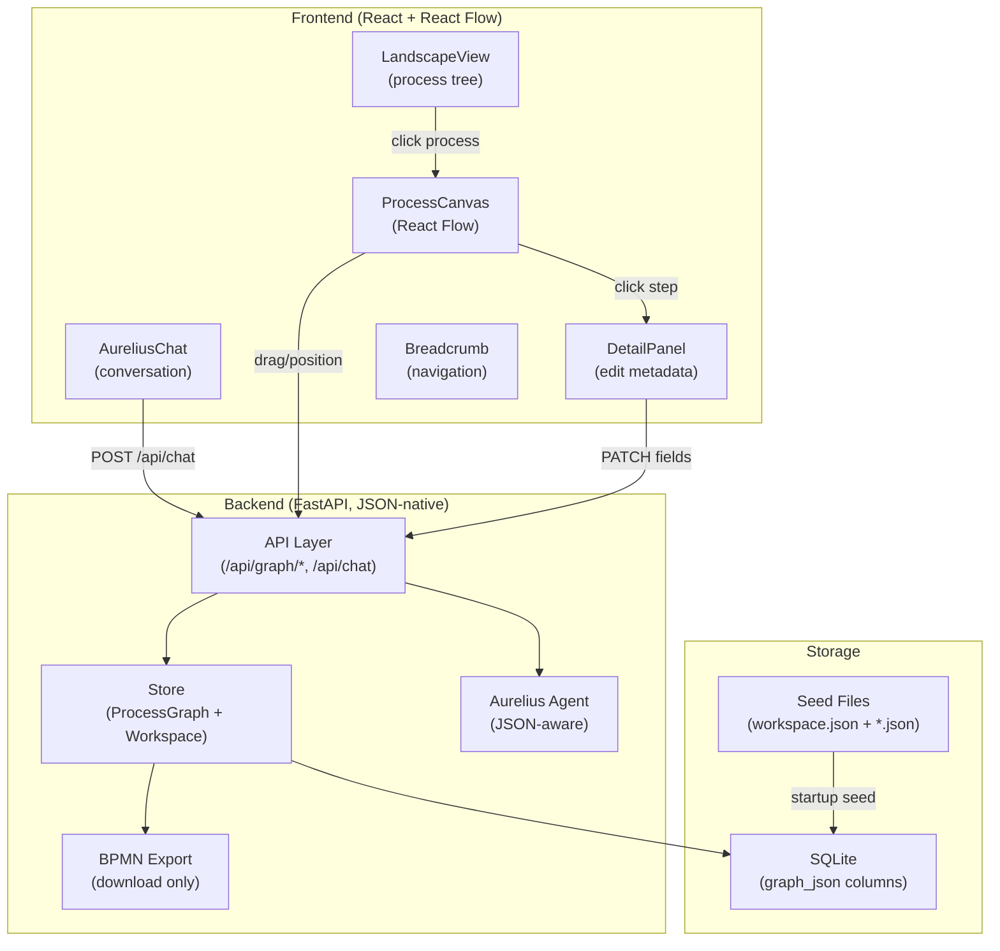

# Consularis v2: React Flow + JSON-Native Architecture

---

## Architecture Overview




---

## 1. File Structure (Final State)

### Backend

```
backend/
  data/
    workspace.json              # NEW: workspace manifest (tree, tags, summaries)
    graphs/
      global.json               # CONVERTED from global.bpmn
      P1.json                   # CONVERTED from P1.bpmn
      P2.json ... P7.json       # CONVERTED
      global.bpmn               # KEPT as reference (not loaded at runtime)
      P1.bpmn ... P7.bpmn       # KEPT as reference
  graph/                        # RENAMED from bpmn/ (no longer BPMN-centric)
    __init__.py
    model.py                    # ProcessGraph class (JSON-backed)
    workspace.py                # NEW: WorkspaceManifest class
    store.py                    # REFACTORED: JSON-native storage
    layout.py                   # REFACTORED: auto-layout -> positions dict
    bpmn_export.py              # RENAMED from serializer.py (JSON -> BPMN XML)
    bpmn_import.py              # RENAMED from parser.py (BPMN XML -> JSON, migration only)
  agent/
    __init__.py
    prompt.py                   # UPDATED: JSON-aware system prompt
    tools.py                    # UPDATED: uses new store API
    runtime.py                  # UPDATED: returns JSON, exports BPMN on demand
  routers/
    graph.py                    # UPDATED: serves JSON, BPMN export endpoint
    chat.py                     # UPDATED: returns graph_json instead of bpmn_xml
  db.py                         # UPDATED: graph_json columns
  config.py                     # MINOR: rename config vars
  main.py                       # MINOR: import path changes
```

### Frontend

```
frontend/src/
  components/
    nodes/                      # NEW: React Flow custom node components
      StepNode.jsx              # Task node (rich card with badges)
      StepNode.css
      DecisionNode.jsx          # Gateway/decision diamond
      SubprocessNode.jsx        # Clickable drill-down card
      EventNode.jsx             # Start/end circle nodes
      nodeTypes.js              # Export map for React Flow
    ProcessCanvas.jsx           # NEW: React Flow canvas (replaces BpmnViewer)
    ProcessCanvas.css
    LandscapeView.jsx           # NEW: top-level process tree map
    LandscapeView.css
    DetailPanel.jsx             # NEW: side panel for editing step fields
    DetailPanel.css
    ProcessBreadcrumb.jsx       # NEW: navigation breadcrumb
    AureliusChat.jsx            # UPDATED: returns graph_json
    AureliusChat.css            # UNCHANGED
    BpmnViewer.jsx              # DELETED (replaced by ProcessCanvas)
    BpmnViewer.css              # DELETED
    DataViewState.jsx           # UNCHANGED
  hooks/
    useProcessGraph.js          # NEW: fetch + manage JSON graph state
    useWorkspace.js             # NEW: fetch workspace manifest
    useBpmnXml.js               # DELETED (replaced by useProcessGraph)
  services/
    api.js                      # UPDATED: JSON endpoints
    graphTransform.js           # NEW: JSON graph -> React Flow nodes/edges
  pages/
    Dashboard.jsx               # REFACTORED: new layout with canvas + panels
    Dashboard.css               # REFACTORED
    Landing.jsx                 # UNCHANGED
    Landing.css                 # UNCHANGED
  App.jsx                       # UNCHANGED
  main.jsx                      # UNCHANGED
  index.css                     # UNCHANGED
```

---

## 2. JSON Schemas

### 2a. Workspace Manifest (`workspace.json`)

This is the lightweight index that the agent and frontend load first.

```json
{
  "format_version": "1.0",
  "workspace_id": "ws_pharmacy",
  "name": "Hospital Pharmacy Operations",

  "process_tree": {
    "root": "Process_Global",
    "processes": {
      "Process_Global": {
        "name": "Pharmacy medication circuit",
        "depth": 0,
        "path": "/Process_Global",
        "children": ["Process_P1", "Process_P2", "Process_P3", "Process_P4", "Process_P5", "Process_P6", "Process_P7"],
        "graph_file": "global.json",
        "owner": "Pharmacy Department",
        "category": "clinical",
        "criticality": "high",
        "summary": {
          "step_count": 9,
          "subprocess_count": 7
        }
      },
      "Process_P1": {
        "name": "Prescription",
        "depth": 1,
        "path": "/Process_Global/Process_P1",
        "children": [],
        "graph_file": "P1.json",
        "owner": "Pharmacy Department",
        "category": "clinical",
        "criticality": "high",
        "summary": {
          "step_count": 3,
          "total_cost_per_run": 18.50,
          "avg_error_rate": 2.03,
          "bottleneck_step": "Approve Prescription",
          "automation_coverage": "67%"
        }
      }
    }
  },

  "cross_links": [],

  "tags": {
    "clinical": ["Process_P1", "Process_P5", "Process_P6"],
    "logistics": ["Process_P3", "Process_P4"],
    "supply_chain": ["Process_P2"],
    "compliance": ["Process_P7"]
  }
}
```

### 2b. Process Document (e.g. `P1.json`)

Individual process files. These are the source of truth for one process.

```json
{
  "format_version": "1.0",
  "process_id": "Process_P1",
  "name": "Prescription",

  "metadata": {
    "owner": "Pharmacy Department",
    "category": "clinical",
    "criticality": "high"
  },

  "lanes": [
    {
      "id": "lane_P1",
      "name": "Prescription",
      "description": "",
      "node_refs": ["start_P1", "s_P1_1", "s_P1_2", "s_P1_3", "end_P1"]
    }
  ],

  "steps": [
    {
      "id": "start_P1",
      "name": "Start",
      "type": "start",
      "lane_id": "lane_P1",
      "position": { "x": 280, "y": 78 }
    },
    {
      "id": "s_P1_1",
      "name": "Prescribe Medication",
      "type": "step",
      "lane_id": "lane_P1",
      "position": { "x": 464, "y": 44 },
      "short_id": "P1.1",
      "actor": "Physician",
      "duration_min": "5-10 min",
      "description": "Doctor writes or enters a prescription...",
      "inputs": ["Patient diagnosis", "Medical history", "Drug formulary"],
      "outputs": ["Prescription order"],
      "risks": ["Prescribing error", "Drug interaction", "Wrong dosage"],
      "automation_potential": "high",
      "automation_notes": "E-prescribing systems, CDS, drug interaction alerts",
      "current_state": "semi_automated",
      "frequency": "150/day",
      "annual_volume": 54750,
      "error_rate_percent": 3.2,
      "cost_per_execution": 8.50,
      "current_systems": ["EHR", "Paper prescription pad"],
      "data_format": "digital_unstructured",
      "external_dependencies": ["Drug formulary DB"],
      "regulatory_constraints": ["Prescription regulations", "Controlled substance laws"],
      "sla_target": "< 10 min",
      "pain_points": ["Illegible handwriting", "Missing allergy data"]
    },
    {
      "id": "s_P1_2",
      "name": "Verify Prescription",
      "type": "step",
      "lane_id": "lane_P1",
      "position": { "x": 824, "y": 44 },
      "short_id": "P1.2",
      "actor": "Pharmacist",
      "duration_min": "5-10 min",
      "cost_per_execution": 6.00,
      "error_rate_percent": 2.1,
      "automation_potential": "high"
    },
    {
      "id": "end_P1",
      "name": "End",
      "type": "end",
      "lane_id": "lane_P1",
      "position": { "x": 1544, "y": 78 }
    }
  ],

  "flows": [
    { "from": "start_P1", "to": "s_P1_1", "label": "Process starts" },
    { "from": "s_P1_1", "to": "s_P1_2", "label": "Prescription submitted" },
    { "from": "s_P1_2", "to": "s_P1_3", "label": "Prescription verified" },
    { "from": "s_P1_3", "to": "end_P1", "label": "Complete" }
  ]
}
```

Key design decisions in this schema:

- `**position**` is stored per step so drag-and-drop changes persist. Auto-layout computes initial positions; user drags override them.
- `**short_id**` (e.g. `P1.2`) is the human/agent-readable alias. The stable `id` (e.g. `s_P1_2`) never changes on reorder/insert.
- **Metadata fields are flat** on the step object (no nested `extension` dict). This is what makes it agent-native -- the LLM reads flat JSON.
- `**type`** enum: `"start"`, `"end"`, `"step"`, `"decision"`, `"subprocess"`. Maps to React Flow node types.
- `**lane_id`** on each step + `node_refs` on each lane gives both directions of the relationship.

---

## 3. React Flow Custom Nodes

### StepNode (the core visual)

This is the enriched card that replaces a plain BPMN task rectangle:

```
+---------------------------------------------------+
|  [icon] Verify Prescription          [Pharmacist]  |
|---------------------------------------------------|
|  5-10 min     |  $6.00/exec    |  2.1% error      |
|---------------------------------------------------|
|  ██████░░░░  HIGH automation potential             |
+---------------------------------------------------+
```

The node adapts based on available data:

- If `cost_per_execution` exists, show cost badge
- If `error_rate_percent` > 5%, badge turns red
- If `automation_potential` is "high", show green progress bar
- If `risks` array is non-empty, show warning indicator

Node colors follow the existing Consularis warm palette (`--bpmn-fill: #f5d4b8`, `--bpmn-stroke: #c97d3a`).

### SubprocessNode

Shows as a card with a "drill down" visual cue (double border or expand icon). Clicking navigates to the child process:

```
+========================================+
||  [>>] Prescription                   ||
||  3 steps | $18.50 total | 2.0% err   ||
+========================================+
```

Summary data comes from `workspace.json` process summaries.

### DecisionNode

Diamond shape with the question text. Outgoing edges labeled with conditions.

### EventNode

Circle (start = thin border, end = thick border). Minimal, like current BPMN events.

### Lanes as Group Nodes

Each lane renders as a React Flow `type: 'group'` node. Steps within a lane have `parentId` set to the lane ID and `extent: 'parent'` so they're constrained within the lane.

---

## 4. Key Frontend Components

### `ProcessCanvas.jsx` -- Main canvas

- Initializes React Flow with `nodeTypes` (StepNode, DecisionNode, SubprocessNode, EventNode)
- Loads JSON from `useProcessGraph(sessionId, processId)`
- Transforms JSON to React Flow format via `graphTransform.js`
- Handles `onNodesChange` for drag-and-drop (sends position updates to backend)
- Handles `onConnect` for creating new edges
- Passes selected node to `DetailPanel`
- Includes MiniMap, Controls, Background

### `graphTransform.js` -- JSON to React Flow converter

```javascript
export function toReactFlowData(graph) {
  const nodes = [];
  const edges = [];

  for (const lane of graph.lanes) {
    nodes.push({
      id: lane.id,
      type: 'group',
      position: computeLanePosition(lane, graph),
      style: { width: computeLaneWidth(lane, graph), height: LANE_HEIGHT },
      data: { label: lane.name },
    });
  }

  for (const step of graph.steps) {
    nodes.push({
      id: step.id,
      type: stepTypeToNodeType(step.type),
      position: step.position || computeAutoPosition(step, graph),
      parentId: step.lane_id || undefined,
      extent: step.lane_id ? 'parent' : undefined,
      data: step,  // full step data passed to custom node
    });
  }

  for (const flow of graph.flows) {
    edges.push({
      id: `${flow.from}-${flow.to}`,
      source: flow.from,
      target: flow.to,
      label: flow.label || '',
      animated: false,
      style: { stroke: '#c97d3a' },
    });
  }

  return { nodes, edges };
}
```

### `LandscapeView.jsx` -- Process tree overview

Renders the workspace manifest as a React Flow graph where each node is a process. Uses Dagre layout (top-to-bottom tree). Click a process -> navigates to `ProcessCanvas` for that process.

### `DetailPanel.jsx` -- Side panel for editing

Slides in from the right when a step is selected on canvas. Shows all metadata fields as a form. Changes are debounced and sent via `PATCH /api/graph/step`. Fields:

- Name, Actor, Duration (top section)
- Cost, Error Rate, Annual Volume, SLA (metrics section)
- Automation Potential, Automation Notes (automation section)
- Inputs, Outputs, Risks (lists section, editable chips)
- Systems, Dependencies, Regulatory Constraints (context section)
- Pain Points (freeform list)

### `ProcessBreadcrumb.jsx` -- Navigation

Shows path from root: `Pharmacy Operations > Prescription > [current view]`. Click any level to navigate up. Built from the `path` field in workspace manifest.

---

## 5. Backend Changes (Detailed)

### `graph/model.py` -- ProcessGraph class

```python
class ProcessGraph:
    """JSON-native process graph. The `data` dict IS the JSON document."""

    def __init__(self, data: dict):
        self.data = data

    @property
    def process_id(self) -> str:
        return self.data["process_id"]

    @property
    def name(self) -> str:
        return self.data["name"]

    @property
    def steps(self) -> list[dict]:
        return self.data.get("steps", [])

    @property
    def flows(self) -> list[dict]:
        return self.data.get("flows", [])

    @property
    def lanes(self) -> list[dict]:
        return self.data.get("lanes", [])

    def get_step(self, step_id: str) -> dict | None:
        return next((s for s in self.steps if s["id"] == step_id), None)

    def get_step_by_short_id(self, short_id: str) -> dict | None:
        return next((s for s in self.steps if s.get("short_id") == short_id), None)

    def get_lane(self, lane_id: str) -> dict | None:
        return next((l for l in self.lanes if l["id"] == lane_id), None)

    def all_node_ids(self) -> set[str]:
        return {s["id"] for s in self.steps}

    def to_json(self) -> str:
        return json.dumps(self.data, indent=2, ensure_ascii=False)

    @classmethod
    def from_json(cls, json_str: str) -> "ProcessGraph":
        return cls(json.loads(json_str))

    def copy(self) -> "ProcessGraph":
        return ProcessGraph(copy.deepcopy(self.data))
```

### `graph/workspace.py` -- WorkspaceManifest

```python
class WorkspaceManifest:
    """Lightweight index of all processes in a workspace."""

    def __init__(self, data: dict):
        self.data = data

    @property
    def process_tree(self) -> dict:
        return self.data.get("process_tree", {})

    def get_process_info(self, process_id: str) -> dict | None:
        return self.process_tree.get("processes", {}).get(process_id)

    def get_children(self, process_id: str) -> list[str]:
        info = self.get_process_info(process_id)
        return info.get("children", []) if info else []

    def get_path(self, process_id: str) -> str:
        info = self.get_process_info(process_id)
        return info.get("path", "") if info else ""

    def all_process_ids(self) -> list[str]:
        return list(self.process_tree.get("processes", {}).keys())

    def update_summary(self, process_id: str, summary: dict):
        info = self.get_process_info(process_id)
        if info:
            info["summary"] = summary
```

### `db.py` -- Schema changes

Replace `bpmn_xml` columns with `graph_json`:

```sql
CREATE TABLE baseline_processes (
    process_id TEXT PRIMARY KEY,
    name       TEXT NOT NULL,
    parent_id  TEXT,
    graph_json TEXT NOT NULL
);

CREATE TABLE session_processes (
    session_id TEXT NOT NULL,
    process_id TEXT NOT NULL,
    graph_json TEXT NOT NULL,
    PRIMARY KEY (session_id, process_id)
);

CREATE TABLE session_process_history (
    id         INTEGER PRIMARY KEY AUTOINCREMENT,
    session_id TEXT NOT NULL,
    process_id TEXT NOT NULL,
    graph_json TEXT NOT NULL,
    created_at TIMESTAMP DEFAULT CURRENT_TIMESTAMP
);
```

Also add a workspace table:

```sql
CREATE TABLE session_workspace (
    session_id     TEXT PRIMARY KEY,
    workspace_json TEXT NOT NULL
);
```

### `routers/graph.py` -- New endpoints

```
GET  /api/graph/json?session_id=...&process_id=...     -> JSON graph document
GET  /api/graph/workspace?session_id=...                -> workspace manifest JSON
GET  /api/graph/export?session_id=...&process_id=...    -> BPMN XML (download)
POST /api/graph/step?session_id=...&process_id=...      -> update step fields
POST /api/graph/position?session_id=...&process_id=...  -> batch update positions
POST /api/graph/undo?session_id=...&process_id=...      -> undo last bot change
```

### `routers/chat.py` -- Response change

```python
class ChatResponse(BaseModel):
    message: str
    graph_json: dict      # was bpmn_xml: str
    process_id: str
    meta: ChatResponseMeta
```

### `graph/bpmn_export.py` -- Export function

Converts `ProcessGraph` -> BPMN 2.0 XML. Type mapping:

- `"step"` -> `<bpmn:task>`
- `"decision"` -> `<bpmn:exclusiveGateway>`
- `"start"` -> `<bpmn:startEvent>`
- `"end"` -> `<bpmn:endEvent>`
- `"subprocess"` -> `<bpmn:callActivity>`
- All 19 metadata fields -> `<consularis:...>` extension elements
- Positions -> BPMNDI diagram interchange

This reuses most logic from the current [backend/bpmn/serializer.py](backend/bpmn/serializer.py) but reads from JSON instead of `BpmnModel`.

---

## 6. Agent Changes

### Updated `agent/prompt.py`

Key changes to the system prompt:

- Reference `short_id` instead of raw IDs (e.g. "P1.2")
- Agent receives the full JSON graph as context (not just a summary) for small processes
- For large processes (>30 steps), agent gets summary + drills into full step on demand
- Agent can now reason about costs, error rates, automation potential because fields are flat JSON

### Agent context strategy

```python
def build_agent_context(graph: ProcessGraph) -> str:
    if len(graph.steps) <= 30:
        return f"Current process JSON:\n{graph.to_json()}"
    else:
        summary = build_compact_summary(graph)
        return f"Process summary (use get_node for full details):\n{summary}"
```

---

## 7. Migration Script

A one-time script to convert `.bpmn` files to `.json`:

```
python -m scripts.migrate_bpmn_to_json
```

Steps:

1. Read each `.bpmn` file using existing `parser.py`
2. Convert `BpmnModel` to JSON schema format
3. Generate `short_id` values from current IDs (P1.1, P1.2, etc.)
4. Compute initial positions from current `layout_bounds()`
5. Generate stable IDs (prefix with `s_`, `start_`, `end_`, `gw_`)
6. Write `.json` files
7. Build `workspace.json` from current `registry.json` + computed summaries

---

## 8. Memory / Storage Architecture

### Hackathon (in-memory SQLite)

```
┌─────────────────────────────────────────────────────┐
│                    SQLite :memory:                   │
│                                                     │
│  baseline_processes     (process_id -> graph_json)   │
│  session_processes      (session+process -> json)    │
│  session_workspace      (session -> workspace_json)  │
│  session_process_history (session+process -> json)   │
│  chat_messages          (session -> role+content)    │
│                                                     │
│  LRU Cache (max 256 entries):                       │
│    (session_id, process_id) -> ProcessGraph object   │
│                                                     │
│  Workspace Cache:                                   │
│    session_id -> WorkspaceManifest object            │
└─────────────────────────────────────────────────────┘
```

Startup flow:

1. Read `workspace.json` and `graphs/*.json` from disk
2. Insert into `baseline_processes` and `baseline_workspace` tables
3. On first request per session, clone baseline -> session tables
4. All mutations write to session tables + invalidate cache

### Post-hackathon (persistent storage path)

Replace SQLite `:memory:` with:

- **Option A**: SQLite file on disk (simplest, single-server)
- **Option B**: PostgreSQL with JSONB columns (multi-server, query JSON fields)
- **Option C**: MongoDB/Firestore (document-native, each process = one document)

The JSON schema is designed to work with all three. No code changes needed beyond the connection string.

### History storage

Hackathon: full JSON snapshots (simple, works with undo).
Post-hackathon: JSON Patch (RFC 6902) for space efficiency. Store diffs, apply/reverse for undo/redo.

---

## 9. Execution Schedule (7 Days)

### Day 1: Backend foundation

- Create `graph/model.py` (ProcessGraph)
- Create `graph/workspace.py` (WorkspaceManifest)
- Write migration script (`scripts/migrate_bpmn_to_json.py`)
- Convert all `.bpmn` seed files to `.json`
- Build `workspace.json` from `registry.json`

### Day 2: Backend store + API

- Update `db.py` schema (graph_json columns + workspace table)
- Refactor `store.py` to use ProcessGraph (JSON-native)
- Rename `bpmn/` to `graph/`, update all imports
- Create `graph/bpmn_export.py` from current serializer
- Update `routers/graph.py` with JSON endpoints
- Update `routers/chat.py` to return graph_json
- Verify all backend tests pass (curl endpoints)

### Day 3: Frontend -- React Flow canvas

- Install `@xyflow/react` and `dagre` (layout)
- Create `nodes/StepNode.jsx` (rich card with badges)
- Create `nodes/EventNode.jsx`, `nodes/DecisionNode.jsx`
- Create `nodes/SubprocessNode.jsx` (drill-down card)
- Create `nodes/nodeTypes.js` (type registry)
- Create `graphTransform.js` (JSON -> React Flow nodes/edges)
- Create `ProcessCanvas.jsx` (React Flow wrapper)
- Create `useProcessGraph.js` hook
- Wire into Dashboard (replace BpmnViewer)

### Day 4: Frontend -- interactions + detail panel

- Implement drag-and-drop position persistence (onNodesChange -> PATCH)
- Create `DetailPanel.jsx` (side panel form for all metadata fields)
- Create `ProcessBreadcrumb.jsx`
- Update `Dashboard.jsx` layout (canvas + panel + breadcrumb)
- Update `api.js` with all new endpoints
- Wire chat to refresh canvas on graph_json response

### Day 5: Frontend -- landscape view + navigation

- Create `LandscapeView.jsx` (workspace tree as React Flow graph)
- Create `useWorkspace.js` hook
- Implement drill-down: LandscapeView -> ProcessCanvas -> subprocess click
- Implement breadcrumb navigation (click to go up)
- Style everything with Consularis warm palette

### Day 6: Agent optimization

- Update `agent/prompt.py` for JSON-native context
- Update `agent/tools.py` to use new store API
- Give agent full JSON context for small processes
- Update `agent/runtime.py` to return graph_json
- Test full chat flow: user message -> agent tool calls -> JSON mutation -> canvas update

### Day 7: Polish + docs

- BPMN XML export button (calls `bpmn_export.py`)
- PNG export from React Flow canvas
- Create `docs/SOURCES.md` (inspiration & references)
- Update `docs/GRAPH_STRUCTURE.md` with new JSON schema
- Update `backend/README.md`
- Remove old `BpmnViewer.jsx`, `BpmnViewer.css`, `useBpmnXml.js`
- Final testing: full flow from landing -> dashboard -> chat -> edit -> drill-down

